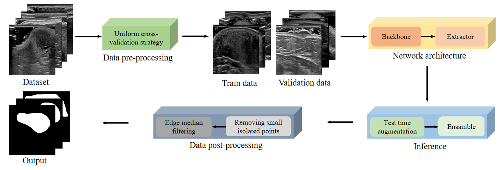
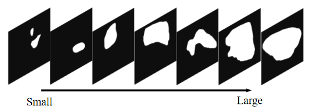
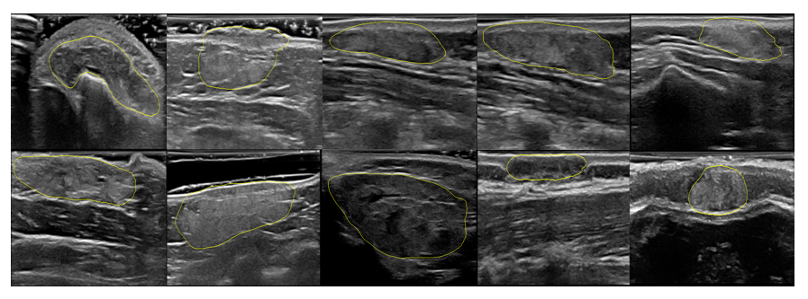

# 1st place solution in CCF BDCI 2021 ULSEG challenge 
This is the source code of the 1st place solution for ultrasound image angioma segmentation task (with Dice 90.32%) in 2021 CCF BDCI challenge.

[[Challenge leaderboard🏆](https://www.datafountain.cn/competitions/533/ranking?sch=1882)]

## 1 Pipeline of our solution
Our solution includes **`data pre-processing`**, **`network training`**,  **`ensabmle inference`** and **`data post-processing`**.
<p align="center">

    <h4 align="center">Ultrasound images of hemangioma segmentation framework</h4>
</p>
### 1.1 Data pre-processing
To improve our performance on the leaderboard, 5-fold cross validation is used to evaluate the performance of our proposed method. In our opinion, it is necessary to **`keep the size distribution of tumor in the training and validation sets`**. We calculate the tumor area for each image and categorize the tumor size into classes: 1) less than 3200 pixels, 2) less than 7200 pixels and greater than 3200 pixels, and 3) greater than 7200 pixels. These two thresholds, 3200 pixels and 7200 pixels, are close to the tertiles. We divide images in each size grade group into 5 folds and combined different grades of single fold into new single fold. This strategy ensured that final 5 folds had similar size distribution. 
<p align="center">

    <h4 align="center">Tumors of different sizes</h4>
</p>
### 1.2 Network training
Due to the small size of the training set, for this competition, we chose a lightweight network structure: **`Linknet with efficientnet-B6 encoder`**. Following methods are performed in **`data augmentation (DA)`**: 1) horizontal flipping, 2) vertical flipping, 3) random cropping, 4) random affine transformation, 5) random scaling, 6) random translation, 7) random rotation, and 8) random shearing transformation. In addition, one of the following methods was randomly selected for **`enhanced data augmentation (EDA)`**: 1) sharpening, 2) local distortion, 3) adjustment of contrast, 4) blurring (Gaussian, mean, median), 5) addition of Gaussian noise, and 6) erasing. 

### 1.3 Ensabmle inference
We ensamble five models (five folds) and do **`test time augmentation (TTA)`** for each model. TTA generally improves the generalization ability of the segmentation model. In our framework, the TTA includes vertical flipping, horizontal flipping, and rotation of 180 degrees for the segmentation task.

### 1.4 Data post-processing
We post-processe the obtained binary mask by **`removing small isolated points (RSIP)`**  and **`edge median filtering (EMF)`** . The edge part of our predicted tumor is not smooth enough, which is not quite in line with the manual annotation of the physician, so we adopt a small trick, i.e., we do a median filtering specifically for the edge part, and the experimental results show that this can improve the accuracy of tumor segmentation.

## 2 Segmentation results on 2021 CCF BDCI dataset
We test our method on 2021 CCD BDCI dataset (215 for training and 107 for testing). The segmentation results of 5-fold CV based on "Linknet with efficientnet-B6 encoder" are as following:

| fold | Linknet | Unet | Att-Unet | DeeplabV3+ | Efficient-b5|Efficient-b6| Resnet-34  | DA | EDA   | TTA  |RSIP | EMF  |Dice (%) |
|:----:|:----:|:----:|:----:|:----:|:----:|:----:|:----:|:----:|:----:|:----:|:----:|:----:|:----:|
| 1      |  |   |   |   | √ |   |   |   |   |   |   |   | 85.06 |
| 1      |  | √ |   |   | √ |   |   |   |   |   |   |   | 84.48 |
| 1      |  |   | √ |  | √ |   |   |   |   |   |   |   | 84.72 |
| 1      |  |   |   | √ | √ |   |   |   |   |   |   |   | 84.93 |
| 1      |√  |   |   |   | √ |   |   |   |   |   |   |   | 86.52 |
| 1      |√  |   |   |   |  |  | √ |   |   |   |   |   | 86.18 |
| 1      |√  |   |   |   |     | √ |   |   |   |   |   |   | 86.91 |
| 1      |√  |   |   |   |     | √ |   | √ |   |   |   |   | 87.38 |
| 1      |√  |   |   |   |     | √ |   |   | √ |   |   |   | 88.36 |
| 1      |√  |   |   |   |     | √ |   |   | √ | √ |   |   | 89.05 |
| 1      |√  |   |   |   |     | √ |   |   | √ | √ | √ |   | 89.20 |
| 1      |√  |   |   |   |     | √ |   |   | √ | √ | √ | √ | 89.52 |
| E      |√  |   |   |   |     | √ |   |   | √ | √ | √ | √ | 90.32 |

## 3 How to run this code?
Here, we split the whole process into **5 steps** so that you can easily replicate our results or perform the whole pipeline on your private custom dataset. 

- step0, preparation of environment
 - step1, run the script [`preprocess.py`](https://github.com/chaineypung/CCF-BDCI-2021-ULSEG-Rank1st/blob/main/preprocess.py) to perform the preprocessing
 - step2, run the script [`train.py`](https://github.com/chaineypung/CCF-BDCI-2021-ULSEG-Rank1st/blob/main/train.py) to train our model
 - step3, run the script [`inference.py`](https://github.com/chaineypung/CCF-BDCI-2021-ULSEG-Rank1st/blob/main/inference.py) to inference the test data.
 - step4, run the script [`postprocess.py`](https://github.com/chaineypung/CCF-BDCI-2021-ULSEG-Rank1st/blob/main/postprocess.py) to perform the preprocessing.

**You should prepare your data in the format of 2021 CCF BDCI dataset, this is very simple, you only need to prepare: two folders store png format images and masks respectively**. You can download them from  [[Homepage](https://www.datafountain.cn/competitions/533/datasets)].

The complete file structure is as follows:
```
  |--- CCF-BDCI-2021-ULSEG-Rank1st
      |--- segmentation_models_pytorch_4TorchLessThan120
          |--- ...
          |--- ...
      |--- saved_model
          |--- pred
          |--- weights
      |--- best_model
          |--- best_model1.pth
          |--- ...
          |--- best_model5.pth
      |--- train_data
          |--- img
          |--- label
          |--- train.csv
      |--- test_data
          |--- img
          |--- predict
      |--- dataset.py
      |--- inference.py
      |--- losses.py
      |--- metrics.py
      |--- ploting.py
      |--- preprocess.py
      |--- postprocess.py
      |--- util.py
      |--- train.py
      |--- visualization.py
      |--- requirement.txt
```


### 3.1 Step0 preparation of environment
We have tested our code in following environment：
 - [`segmentation_models_pytorch`](https://github.com/qubvel/segmentation_models.pytorch) 
 - [`ttach`](https://github.com/qubvel/ttach) == 0.0.3
 - `torch` >＝1.2.0
 - [`imgaug`](https://github.com/aleju/imgaug)
 - `cv2`
 - `sklearn`
 - `skimage`

For installing these, run the following code:
```
pip install -r requirements.txt
```

### 3.2 Step1 preprocessing

In step1, you should run the script and `train.csv` can be generated under `train_data` fold:
```
python preprocess.py \
--image_path="./train_data/label" \
--csv_path="./train_data/train.csv"
```

### 3.3 Step2 training
With the csv file `train.csv`, you can directly perform K-fold cross validation (default is 5-fold), and the script uses a fixed random seed to ensure that the K-fold cv of each experiment is repeatable. Run the following code:

```
python train.py \
--input_channel=1 \
--output_class=1 \
--image_resolution=256 \
--epochs=100 \
--num_workers=2 \
--device=0 \
--batch_size=8 \
--backbone="efficientnet-b6" \
--network="Linknet" \
--initial_learning_rate=1e-7 \
--t_max=110 \
--folds=5 \
--k_th_fold=1 \
--fold_file_list="./train_data/train.csv" \
--train_dataset_path="./train_data/img" \
--train_gt_dataset_path="./train_data/label" \
--saved_model_path="./saved_model" \
--visualize_of_data_aug_path="./saved_model/pred" \
--weights_path="./saved_model/weights" \
--weights="./saved_model/weights/best_model.pth" 
```

By specifying the parameter `k_th_fold` from 1 to `folds` and running repeatedly, you can complete the training of all K folds. After each fold training, you need to copy the `.pth` file from the `weights` path to the `best_model` folder.

### 3.4 Step3 inference (test)

Before running the script, make sure that you have generated five models and saved them in the `best_model` folder. Run the following code:

```
python inference.py \
--input_channel=1 \
--output_class=1 \
--image_resolution=256 \
--device=0 \
--backbone="efficientnet-b6" \
--network="Linknet" \
--weights1="./saved_model/weights/best_model1.pth" \
--weights2="./saved_model/weights/best_model2.pth" \
--weights3="./saved_model/weights/best_model3.pth" \
--weights4="./saved_model/weights/best_model4.pth" \
--weights5="./saved_model/weights/best_model5.pth" \
--test_path="./test_data/img" \
--saved_path="./test_data/predict" 
```

The results of the model inference will be saved in the `predict` folder.

### 3.5 Step4 postprocess
Run the following code:
```
python postprocess.py \
--image_path="./test_data/predict" \
--threshood=50 \
--kernel=20 
```

**Alternatively, if you want to observe the overlap between the predicted result and the original image, we also provide a visualization script `visualization.py`**. Modify the image path in the code and run the script directly.

<p align="center">

    <h4 align="center">Visualization of tumor margins</h4>
</p>

## 4 Acknowledgement

- Thanks to the organizers of the 2021 CCF BDCI challenge.
- Thanks to the 2020 MICCCAI TNSCUI [TOP 1](https://github.com/WAMAWAMA) for making the code public.
- Thanks to [qubvel](https://github.com/qubvel), the author of `smg` and `ttach`, all network and TTA used in this code come from his implement.

